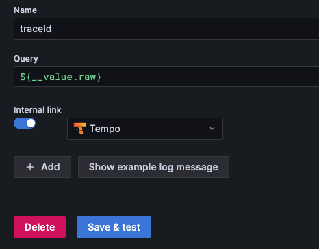
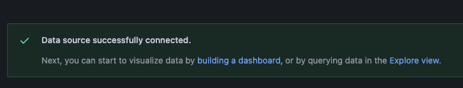
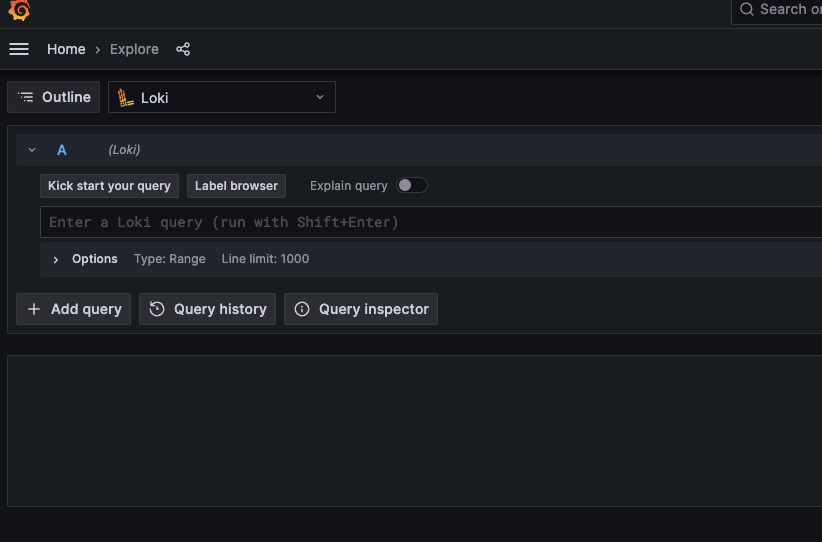
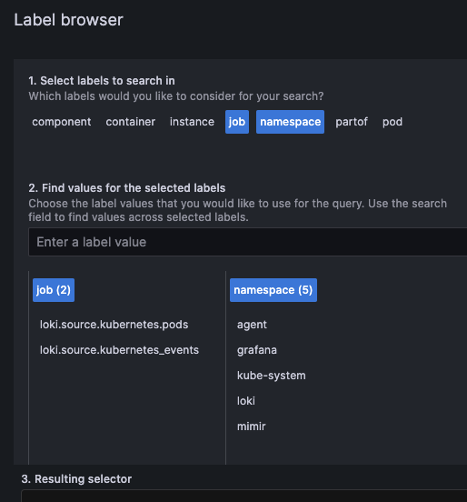
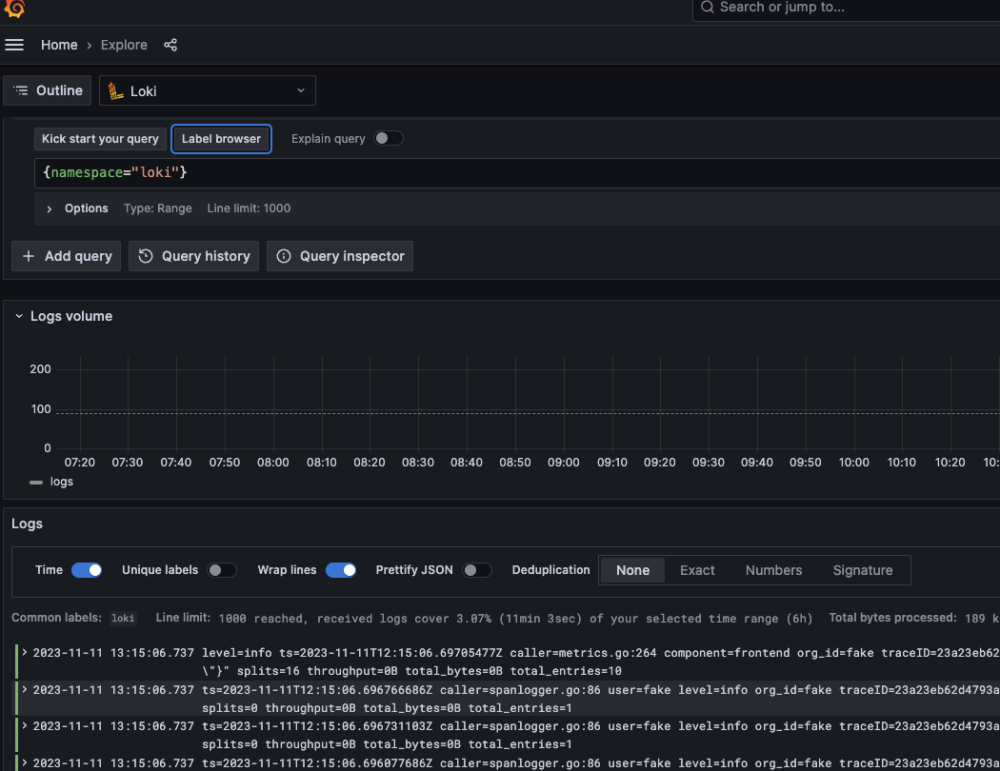

# 04 Grafana Loki

## Dateien erstellen

In das Verzeichnis 04_loki wechseln und folgende Dateien erstellen

**loki-config.yaml**

```
apiVersion: v1
kind: ConfigMap
metadata:
  name: loki-config
  labels:
    app.kubernetes.io/component: loki
    kustomize.toolkit.fluxcd.io/substitute: disabled
  annotations:
    kustomize.toolkit.fluxcd.io/substitute: disabled
data:
  config.yaml: |-
    auth_enabled: false

    # -- Check https://grafana.com/docs/loki/latest/configuration/#server for more info on the server configuration.
    server:
      http_listen_port: 3100
      grpc_listen_port: 9095
      http_server_read_timeout: 300s
      http_server_write_timeout: 300s
      log_level: debug
    
    tracing:
      enabled: true

    memberlist:
      abort_if_cluster_join_fails: false
      bind_port: 7946
      max_join_backoff: 1m
      max_join_retries: 10
      min_join_backoff: 1s
      join_members:
      - loki-memberlist.loki.svc.cluster.local:7946

    schema_config:
      configs:
      - from: 2023-10-12
        store: tsdb
        object_store: s3
        schema: v13
        index:
          prefix: index_
          period: 24h

    # -- Limits config
    limits_config:
      ingestion_rate_mb: 50
      ingestion_burst_size_mb: 75
      max_global_streams_per_user: 15000
      reject_old_samples: true
      reject_old_samples_max_age: 168h
      max_cache_freshness_per_query: 10m
      split_queries_by_interval: 15m
      per_stream_rate_limit: 5MB
      per_stream_rate_limit_burst: 20MB
      max_query_lookback: 720h
      max_query_length: 72h
      retention_period: 744h
      query_timeout: 5m

    # -- Additional storage config
    storage_config:
      hedging:
        at: "250ms"
        max_per_second: 20
        up_to: 3
      tsdb_shipper:
        active_index_directory: /var/loki/data/tsdb-index
        cache_location: /var/loki/data/tsdb-cache
        cache_ttl: 24h         # Can be increased for faster performance over longer query periods, uses more disk space

      # --  Optional compactor configuration
    compactor:
      working_directory: /var/loki/data/retention
      compaction_interval: 5m
      retention_enabled: true
      retention_delete_delay: 2h
      retention_delete_worker_count: 150
      delete_request_store: s3

    ingester:
      autoforget_unhealthy: false
      chunk_encoding: snappy
      wal:
        flush_on_shutdown: true

    # -- Check https://grafana.com/docs/loki/latest/configuration/#common_config for more info on how to provide a common configuration
    common:
      path_prefix: /var/loki
      replication_factor: 1
      compactor_address: loki-backend

      storage:
        s3:
          endpoint: ${S3_ENDPOINT}
          region: eu-frankfurt-1
          bucketnames: ${S3_BUCKET}
          access_key_id: ${S3_ACCESSKEY}
          secret_access_key: ${S3_SECRETKEY}
          insecure: true
          http_config:
            idle_conn_timeout: 90s
            response_header_timeout: 0s
            insecure_skip_verify: false
          s3forcepathstyle: true

      ring:
        kvstore:
          store: memberlist

    querier:
      max_concurrent: 16

    query_scheduler:
      max_outstanding_requests_per_tenant: 32768

    query_range:
      parallelise_shardable_queries: true
      align_queries_with_step: true
      max_retries: 5
      cache_results: true
      results_cache:
        cache:
          embedded_cache:
            enabled: true

    ruler:
      #remote_write:
      #  enabled: true
      #  clients:	
      #    mimir:	
      #      url: http://mimir.mimir.svc.cluster.local/api/v1/push
      #      write_relabel_configs:
      #      - action: replace
      #        target_label: job
      #        replacement: loki-recording-rules
      storage:
        s3:
          bucketnames: ${S3_BUCKET}

    analytics:
      reporting_enabled: false
```

**loki-values.yaml**

```
global:
  image:
    # -- Overrides the Docker registry globally for all images
    registry: null
  # -- Overrides the priorityClassName for all pods
  priorityClassName: null
  # -- configures cluster domain ("cluster.local" by default)
  clusterDomain: "cluster.local"
  # -- configures DNS service name
  dnsService: "kube-dns"
  # -- configures DNS service namespace
  dnsNamespace: "kube-system"
# -- Overrides the chart's name
nameOverride: null
# -- Overrides the chart's computed fullname
fullnameOverride: null
# -- Overrides the chart's cluster label
clusterLabelOverride: null
# -- Image pull secrets for Docker images
imagePullSecrets: []
# -- Deployment mode lets you specify how to deploy Loki.
# There are 3 options:
# - SingleBinary: Loki is deployed as a single binary, useful for small installs typically without HA, up to a few tens of GB/day.
# - SimpleScalable: Loki is deployed as 3 targets: read, write, and backend. Useful for medium installs easier to manage than distributed, up to a about 1TB/day.
# - Distributed: Loki is deployed as individual microservices. The most complicated but most capable, useful for large installs, typically over 1TB/day.
# There are also 2 additional modes used for migrating between deployment modes:
# - SingleBinary<->SimpleScalable: Migrate from SingleBinary to SimpleScalable (or vice versa)
# - SimpleScalable<->Distributed: Migrate from SimpleScalable to Distributed (or vice versa)
# Note: SimpleScalable and Distributed REQUIRE the use of object storage.
deploymentMode: SimpleScalable
######################################################################################################################
#
# Base Loki Configs including kubernetes configurations and configurations for Loki itself,
# see below for more specifics on Loki's configuration.
#
######################################################################################################################
# -- Configuration for running Loki
# @default -- See values.yaml
loki:
  # Configures the readiness probe for all of the Loki pods
  readinessProbe:
    httpGet:
      path: /ready
      port: http-metrics
    initialDelaySeconds: 30
    timeoutSeconds: 1
  image:
    # -- The Docker registry
    registry: docker.io
    # -- Docker image repository
    repository: grafana/loki
    # -- Overrides the image tag whose default is the chart's appVersion
    # TODO: needed for 3rd target backend functionality
    # revert to null or latest once this behavior is relased
    tag: 3.2.1
    # -- Overrides the image tag with an image digest
    digest: null
    # -- Docker image pull policy
    pullPolicy: IfNotPresent
  # -- Common annotations for all deployments/StatefulSets
  annotations: {}
  # -- Common annotations for all pods
  podAnnotations: {}
  # -- Common labels for all pods
  podLabels: {}
  # -- Common annotations for all services
  serviceAnnotations: {}
  # -- Common labels for all services
  serviceLabels: {}
  # -- The number of old ReplicaSets to retain to allow rollback
  revisionHistoryLimit: 10
  # -- The SecurityContext for Loki pods
  podSecurityContext:
    fsGroup: 10001
    runAsGroup: 10001
    runAsNonRoot: true
    runAsUser: 10001
  # -- The SecurityContext for Loki containers
  containerSecurityContext:
    readOnlyRootFilesystem: true
    capabilities:
      drop:
        - ALL
    allowPrivilegeEscalation: false
  # -- Should enableServiceLinks be enabled. Default to enable
  enableServiceLinks: true
  useTestSchema: true
  ######################################################################################################################
  #
  # Loki Configuration
  #
  # There are several ways to pass configuration to Loki, listing them here in order of our preference for how
  # you should use this chart.
  # 1. Use the templated value of loki.config below and the corresponding override sections which follow.
  #    This allows us to set a lot of important Loki configurations and defaults and also allows us to maintain them
  #    over time as Loki changes and evolves.
  # 2. Use the loki.structuredConfig section.
  #    This will completely override the templated value of loki.config, so you MUST provide the entire Loki config
  #    including any configuration that we set in loki.config unless you explicitly are trying to change one of those
  #    values and are not able to do so with the templated sections.
  #    If you choose this approach the burden is on you to maintain any changes we make to the templated config.
  # 3. Use an existing secret or configmap to provide the configuration.
  #    This option is mostly provided for folks who have external processes which provide or modify the configuration.
  #    When using this option you can specify a different name for loki.generatedConfigObjectName and configObjectName
  #    if you have a process which takes the generated config and modifies it, or you can stop the chart from generating
  #    a config entirely by setting loki.generatedConfigObjectName to
  #
  ######################################################################################################################

  # -- Defines what kind of object stores the configuration, a ConfigMap or a Secret.
  # In order to move sensitive information (such as credentials) from the ConfigMap/Secret to a more secure location (e.g. vault), it is possible to use [environment variables in the configuration](https://grafana.com/docs/loki/latest/configuration/#use-environment-variables-in-the-configuration).
  # Such environment variables can be then stored in a separate Secret and injected via the global.extraEnvFrom value. For details about environment injection from a Secret please see [Secrets](https://kubernetes.io/docs/concepts/configuration/secret/#use-case-as-container-environment-variables).
  configStorageType: ConfigMap
  # -- The name of the object which Loki will mount as a volume containing the config.
  # If the configStorageType is Secret, this will be the name of the Secret, if it is ConfigMap, this will be the name of the ConfigMap.
  # The value will be passed through tpl.
  configObjectName: loki-config
  # -- The name of the Secret or ConfigMap that will be created by this chart.
  # If empty, no configmap or secret will be created.
  # The value will be passed through tpl.
  generatedConfigObjectName: 


######################################################################################################################
#
# Chart Testing
#
######################################################################################################################

# -- Section for configuring optional Helm test
test:
  enabled: false
# The Loki canary pushes logs to and queries from this loki installation to test
# that it's working correctly
lokiCanary:
  enabled: false
  # -- If true, the canary will send directly to Loki via the address configured for verification --
  # -- If false, it will write to stdout and an Agent will be needed to scrape and send the logs --
  push: true
  # -- The name of the label to look for at loki when doing the checks.
  labelname: pod
  service:
    # -- Annotations for loki-canary Service
    annotations: {}
    # -- Additional labels for loki-canary Service
    labels: {}
  # -- Image to use for loki canary
  image:
    # -- The Docker registry
    registry: docker.io
    # -- Docker image repository
    repository: grafana/loki-canary
    # -- Overrides the image tag whose default is the chart's appVersion
    tag: null
    # -- Overrides the image tag with an image digest
    digest: null
    # -- Docker image pull policy
    pullPolicy: IfNotPresent
  # -- Update strategy for the `loki-canary` Daemonset pods
  updateStrategy:
    type: RollingUpdate
    rollingUpdate:
      maxUnavailable: 1
######################################################################################################################
#
# Service Accounts and Kubernetes RBAC
#
######################################################################################################################
serviceAccount:
  # -- Specifies whether a ServiceAccount should be created
  create: true
  # -- Set this toggle to false to opt out of automounting API credentials for the service account
  automountServiceAccountToken: true
# RBAC configuration
rbac:
  # -- If pspEnabled true, a PodSecurityPolicy is created for K8s that use psp.
  pspEnabled: false
  # -- For OpenShift set pspEnabled to 'false' and sccEnabled to 'true' to use the SecurityContextConstraints.
  sccEnabled: false
  # -- Whether to install RBAC in the namespace only or cluster-wide. Useful if you want to watch ConfigMap globally.
  namespaced: false
######################################################################################################################
#
# Network Policy configuration
#
######################################################################################################################
networkPolicy:
  # -- Specifies whether Network Policies should be created
  enabled: false
 
######################################################################################################################
#
# Global memberlist configuration
#
######################################################################################################################

# Configuration for the memberlist service
memberlist:
  service:
    publishNotReadyAddresses: true

######################################################################################################################
#
# Gateway and Ingress
#
# By default this chart will deploy a Nginx container to act as a gateway which handles routing of traffic
# and can also do auth.
#
# If you would prefer you can optionally disable this and enable using k8s ingress to do the incoming routing.
#
######################################################################################################################

# Configuration for the gateway
gateway:
  # -- Specifies whether the gateway should be enabled
  enabled: true
  # -- Number of replicas for the gateway
  replicas: 1
  # -- Enable logging of 2xx and 3xx HTTP requests
  verboseLogging: true
  autoscaling:
    # -- Enable autoscaling for the gateway
    enabled: false

  deploymentStrategy:
    type: RollingUpdate
  image:
    # -- The Docker registry for the gateway image
    registry: docker.io
    # -- The gateway image repository
    repository: nginxinc/nginx-unprivileged
    # -- The gateway image tag
    tag: 1.24-alpine
    # -- Overrides the gateway image tag with an image digest
    digest: null
    # -- The gateway image pull policy
    pullPolicy: IfNotPresent
  # -- The name of the PriorityClass for gateway pods
  podSecurityContext:
    fsGroup: 101
    runAsGroup: 101
    runAsNonRoot: true
    runAsUser: 101
  # -- The SecurityContext for gateway containers
  containerSecurityContext:
    readOnlyRootFilesystem: true
    capabilities:
      drop:
        - ALL
    allowPrivilegeEscalation: false
  # -- Resource requests and limits for the gateway
  resources: {}
  # -- Grace period to allow the gateway to shutdown before it is killed
  terminationGracePeriodSeconds: 30
  # Gateway service configuration
  service:
    # -- Port of the gateway service
    port: 80
    # -- Type of the gateway service
    type: ClusterIP
    # -- ClusterIP of the gateway service
  # Gateway ingress configuration
  ingress:
    # -- Specifies whether an ingress for the gateway should be created
    enabled: false
  # Basic auth configuration
  basicAuth:
    # -- Enables basic authentication for the gateway
    enabled: false
  # Configures the readiness probe for the gateway
  readinessProbe:
    httpGet:
      path: /
      port: http-metrics
    initialDelaySeconds: 15
    timeoutSeconds: 1
  nginxConfig:
    # -- Which schema to be used when building URLs. Can be 'http' or 'https'.
    schema: http
    # -- Enable listener for IPv6, disable on IPv4-only systems
    enableIPv6: false
    # -- NGINX log format
    logFormat: |-
      main '$remote_addr - $remote_user [$time_local]  $status '
              '"$request" $body_bytes_sent "$http_referer" '
              '"$http_user_agent" "$http_x_forwarded_for"';
    # -- Allows appending custom configuration to the server block
    serverSnippet: ""
    # -- Allows appending custom configuration to the http block, passed through the `tpl` function to allow templating
    httpSnippet: >-
      {{ if .Values.loki.tenants }}proxy_set_header X-Scope-OrgID $remote_user;{{ end }}
    # -- Whether ssl should be appended to the listen directive of the server block or not.
    ssl: false
    # -- Override Read URL
    customReadUrl: null
    # -- Override Write URL
    customWriteUrl: null
    # -- Override Backend URL
    customBackendUrl: null

######################################################################################################################
#
# Migration
#
######################################################################################################################

# -- Options that may be necessary when performing a migration from another helm chart
migrate:
  # -- When migrating from a distributed chart like loki-distributed or enterprise-logs
  fromDistributed:
    # -- Set to true if migrating from a distributed helm chart
    enabled: false
    # -- If migrating from a distributed service, provide the distributed deployment's
    # memberlist service DNS so the new deployment can join its ring.
    memberlistService: ""

######################################################################################################################
#
# Simple Scalable Deployment (SSD) Mode
#
# For small to medium size Loki deployments up to around 1 TB/day, this is the default mode for this helm chart
#
######################################################################################################################

# Configuration for the write pod(s)
write:
  # -- Number of replicas for the write
  replicas: 1
  autoscaling:
    # -- Enable autoscaling for the write.
    enabled: false
  targetModule: "write"
  # -- Additional CLI args for the write
  extraArgs: 
  - -config.expand-env=true
  # -- Environment variables to add to the read pods
  extraEnv:
  - name: S3_ACCESSKEY
    valueFrom:
      secretKeyRef:
        name: minio-s3-credentials
        key: S3_ACCESS_KEY_ID
  - name: S3_SECRETKEY
    valueFrom:
      secretKeyRef:
        name: minio-s3-credentials
        key: S3_SECRET_ACCESS_KEY
  - name: S3_ENDPOINT
    valueFrom:
      secretKeyRef:
        name: minio-s3-credentials
        key: ENDPOINT
  - name: S3_BUCKET
    value: lokilogs
  # -- Environment variables from secrets or configmaps to add to the write pods
  extraEnvFrom: []
  # -- Lifecycle for the write container
  lifecycle: {}
  # -- The default /flush_shutdown preStop hook is recommended as part of the ingester
  # scaledown process so it's added to the template by default when autoscaling is enabled,
  # but it's disabled to optimize rolling restarts in instances that will never be scaled
  # down or when using chunks storage with WAL disabled.
  # https://github.com/grafana/loki/blob/main/docs/sources/operations/storage/wal.md#how-to-scale-updown
  # -- Init containers to add to the write pods
  terminationGracePeriodSeconds: 300
  podManagementPolicy: "Parallel"
  persistence:
    # -- Enable volume claims in pod spec
    volumeClaimsEnabled: true
    # -- Parameters used for the `data` volume when volumeClaimEnabled if false
    dataVolumeParameters:
      emptyDir: {}
    # -- Enable StatefulSetAutoDeletePVC feature
    enableStatefulSetAutoDeletePVC: false
    # -- Size of persistent disk
    size: 10Gi
    # -- Storage class to be used.
    # If defined, storageClassName: <storageClass>.
    # If set to "-", storageClassName: "", which disables dynamic provisioning.
    # If empty or set to null, no storageClassName spec is
    # set, choosing the default provisioner (gp2 on AWS, standard on GKE, AWS, and OpenStack).
    storageClass: null
    # -- Selector for persistent disk
    selector: null
    # -- Annotations for volume claim
    annotations: {}
# --  Configuration for the read pod(s)
read:
  # -- Number of replicas for the read
  replicas: 1
  autoscaling:
    # -- Enable autoscaling for the read, this is only used if `queryIndex.enabled: true`
    enabled: false
  targetModule: "read"
  # -- Whether or not to use the 2 target type simple scalable mode (read, write) or the
  # 3 target type (read, write, backend). Legacy refers to the 2 target type, so true will
  # run two targets, false will run 3 targets.
  legacyReadTarget: false
  # -- Additional CLI args for the read
  extraArgs: 
  - -config.expand-env=true
  # -- Containers to add to the read pods
  extraContainers: []
  # -- Environment variables to add to the read pods
  extraEnv:
  - name: S3_ACCESSKEY
    valueFrom:
      secretKeyRef:
        name: minio-s3-credentials
        key: S3_ACCESS_KEY_ID
  - name: S3_SECRETKEY
    valueFrom:
      secretKeyRef:
        name: minio-s3-credentials
        key: S3_SECRET_ACCESS_KEY
  - name: S3_ENDPOINT
    valueFrom:
      secretKeyRef:
        name: minio-s3-credentials
        key: ENDPOINT
  - name: S3_BUCKET
    value: lokilogs
  # -- Environment variables from secrets or configmaps to add to the read pods
  extraEnvFrom: []
  resources: {}
  terminationGracePeriodSeconds: 30
  podManagementPolicy: "Parallel"
  persistence:
    # -- Enable StatefulSetAutoDeletePVC feature
    enableStatefulSetAutoDeletePVC: true
    # -- Size of persistent disk
    size: 10Gi
    # -- Storage class to be used.
    # If defined, storageClassName: <storageClass>.
    # If set to "-", storageClassName: "", which disables dynamic provisioning.
    # If empty or set to null, no storageClassName spec is
    # set, choosing the default provisioner (gp2 on AWS, standard on GKE, AWS, and OpenStack).
    storageClass: null
    # -- Selector for persistent disk
    selector: null
    # -- Annotations for volume claim
    annotations: {}
# --  Configuration for the backend pod(s)
backend:
  # -- Number of replicas for the backend
  replicas: 1
  autoscaling:
    # -- Enable autoscaling for the backend.
    enabled: false
  targetModule: "backend"
  # -- Additional CLI args for the backend
  extraArgs: 
  - -config.expand-env=true
  # -- Environment variables to add to the read pods
  extraEnv:
  - name: S3_ACCESSKEY
    valueFrom:
      secretKeyRef:
        name: minio-s3-credentials
        key: S3_ACCESS_KEY_ID
  - name: S3_SECRETKEY
    valueFrom:
      secretKeyRef:
        name: minio-s3-credentials
        key: S3_SECRET_ACCESS_KEY
  - name: S3_ENDPOINT
    valueFrom:
      secretKeyRef:
        name: minio-s3-credentials
        key: ENDPOINT
  - name: S3_BUCKET
    value: lokilogs
  # -- Environment variables from secrets or configmaps to add to the backend pods
  extraEnvFrom: []
  terminationGracePeriodSeconds: 300
  podManagementPolicy: "Parallel"
  persistence:
    # -- Enable volume claims in pod spec
    volumeClaimsEnabled: true
    # -- Parameters used for the `data` volume when volumeClaimEnabled if false
    dataVolumeParameters:
      emptyDir: {}
    # -- Enable StatefulSetAutoDeletePVC feature
    enableStatefulSetAutoDeletePVC: true
    # -- Size of persistent disk
    size: 10Gi
    # -- Storage class to be used.
    # If defined, storageClassName: <storageClass>.
    # If set to "-", storageClassName: "", which disables dynamic provisioning.
    # If empty or set to null, no storageClassName spec is
    # set, choosing the default provisioner (gp2 on AWS, standard on GKE, AWS, and OpenStack).
    storageClass: null
    # -- Selector for persistent disk
    selector: null
    # -- Annotations for volume claim
    annotations: {}

sidecar:
  image:
    # -- The Docker registry and image for the k8s sidecar
    repository: kiwigrid/k8s-sidecar
    # -- Docker image tag
    tag: 1.24.3
    # -- Docker image sha. If empty, no sha will be used
    sha: ""
    # -- Docker image pull policy
    pullPolicy: IfNotPresent
  # -- Resource requests and limits for the sidecar
  resources: {}
  #   limits:
  #     cpu: 100m
  #     memory: 100Mi
  #   requests:
  #     cpu: 50m
  #     memory: 50Mi
  # -- The SecurityContext for the sidecar.
  securityContext: {}
  # -- Set to true to skip tls verification for kube api calls.
  skipTlsVerify: false
  # -- Ensure that rule files aren't conflicting and being overwritten by prefixing their name with the namespace they are defined in.
  enableUniqueFilenames: false
  # -- Readiness probe definition. Probe is disabled on the sidecar by default.
  readinessProbe: {}
  # -- Liveness probe definition. Probe is disabled on the sidecar by default.
  livenessProbe: {}
  rules:
    # -- Whether or not to create a sidecar to ingest rule from specific ConfigMaps and/or Secrets.
    enabled: true
    # -- Label that the configmaps/secrets with rules will be marked with.
    label: loki_rule
    # -- Label value that the configmaps/secrets with rules will be set to.
    labelValue: ""
    # -- Folder into which the rules will be placed.
    folder: /rules
    # -- Comma separated list of namespaces. If specified, the sidecar will search for config-maps/secrets inside these namespaces.
    # Otherwise the namespace in which the sidecar is running will be used.
    # It's also possible to specify 'ALL' to search in all namespaces.
    searchNamespace: null
    # -- Method to use to detect ConfigMap changes. With WATCH the sidecar will do a WATCH request, with SLEEP it will list all ConfigMaps, then sleep for 60 seconds.
    watchMethod: WATCH
    # -- Search in configmap, secret, or both.
    resource: both
    # -- Absolute path to the shell script to execute after a configmap or secret has been reloaded.
    script: null
    # -- WatchServerTimeout: request to the server, asking it to cleanly close the connection after that.
    # defaults to 60sec; much higher values like 3600 seconds (1h) are feasible for non-Azure K8S.
    watchServerTimeout: 60
    #
    # -- WatchClientTimeout: is a client-side timeout, configuring your local socket.
    # If you have a network outage dropping all packets with no RST/FIN,
    # this is how long your client waits before realizing & dropping the connection.
    # Defaults to 66sec.
    watchClientTimeout: 60
    # -- Log level of the sidecar container.
    logLevel: INFO
############################################## WARNING ###############################################################
#
# DEPRECATED VALUES
#
# The following values are deprecated and will be removed in a future version of the helm chart!
#
############################################## WARNING ##############################################################

# -- DEPRECATED Monitoring section determines which monitoring features to enable, this section is being replaced
# by https://github.com/grafana/meta-monitoring-chart
monitoring:
  # Dashboards for monitoring Loki
  dashboards:
    # -- If enabled, create configmap with dashboards for monitoring Loki
    enabled: true
    # -- Alternative namespace to create dashboards ConfigMap in
    namespace: null
    # -- Additional annotations for the dashboards ConfigMap
    annotations: {}
    # -- Labels for the dashboards ConfigMap
    labels:
      grafana_dashboard: "1"
  # Recording rules for monitoring Loki, required for some dashboards
  rules:
    # -- If enabled, create PrometheusRule resource with Loki recording rules
    enabled: true
    # -- Include alerting rules
    alerting: true
    # -- Specify which individual alerts should be disabled
    # -- Instead of turning off each alert one by one, set the .monitoring.rules.alerting value to false instead.
    # -- If you disable all the alerts and keep .monitoring.rules.alerting set to true, the chart will fail to render.
    disabled: {}
    #  LokiRequestErrors: true
    #  LokiRequestPanics: true
    # -- Alternative namespace to create PrometheusRule resources in
    namespace: null
    # -- Additional annotations for the rules PrometheusRule resource
    annotations: {}
    # -- Additional labels for the rules PrometheusRule resource
    labels: {}
    # -- Additional labels for PrometheusRule alerts
    additionalRuleLabels: {}
    # -- Additional groups to add to the rules file
    additionalGroups: []
    # - name: additional-loki-rules
    #   rules:
    #     - record: job:loki_request_duration_seconds_bucket:sum_rate
    #       expr: sum(rate(loki_request_duration_seconds_bucket[1m])) by (le, job)
    #     - record: job_route:loki_request_duration_seconds_bucket:sum_rate
    #       expr: sum(rate(loki_request_duration_seconds_bucket[1m])) by (le, job, route)
    #     - record: node_namespace_pod_container:container_cpu_usage_seconds_total:sum_rate
    #       expr: sum(rate(container_cpu_usage_seconds_total[1m])) by (node, namespace, pod, container)
  # ServiceMonitor configuration
  serviceMonitor:
    # -- If enabled, ServiceMonitor resources for Prometheus Operator are created
    enabled: true
    # -- Namespace selector for ServiceMonitor resources
    namespaceSelector: {}
    # -- ServiceMonitor scrape interval
    # Default is 15s because included recording rules use a 1m rate, and scrape interval needs to be at
    # least 1/4 rate interval.
    interval: 15s
    # -- ServiceMonitor scrape timeout in Go duration format (e.g. 15s)
    scrapeTimeout: null
    # -- ServiceMonitor relabel configs to apply to samples before scraping
    # https://github.com/prometheus-operator/prometheus-operator/blob/master/Documentation/api.md#relabelconfig
    relabelings: []
    # -- ServiceMonitor metric relabel configs to apply to samples before ingestion
    # https://github.com/prometheus-operator/prometheus-operator/blob/main/Documentation/api.md#endpoint
    metricRelabelings: []
    # -- ServiceMonitor will use http by default, but you can pick https as well
    scheme: http
    # -- ServiceMonitor will use these tlsConfig settings to make the health check requests
    tlsConfig: null
    # -- If defined, will create a MetricsInstance for the Grafana Agent Operator.
    metricsInstance:
      # -- If enabled, MetricsInstance resources for Grafana Agent Operator are created
      enabled: true
      # -- MetricsInstance annotations
      annotations: {}
      # -- Additional MetricsInstance labels
      labels: {}
      # -- If defined a MetricsInstance will be created to remote write metrics.
      remoteWrite: null
  # Self monitoring determines whether Loki should scrape its own logs.
  # This feature currently relies on the Grafana Agent Operator being installed,
  # which is installed by default using the grafana-agent-operator sub-chart.
  # It will create custom resources for GrafanaAgent, LogsInstance, and PodLogs to configure
  # scrape configs to scrape its own logs with the labels expected by the included dashboards.
  selfMonitoring:
    enabled: false
# Caches deaktiviert wegen Ressourcen
chunksCache:
  enabled: false
resultsCache:
  enabled: false
```

## Installation loki

Die ConfigMap anlegen

```
kubectl apply -f loki-config.yaml -n loki
```

Loki mit Helm installieren

```
helm -n loki upgrade --install loki grafana/loki -f loki-values.yaml
```

## Prüfen

Ausgabe der Helm-Installation

```
Release "loki" does not exist. Installing it now.
NAME: loki
LAST DEPLOYED: Wed Nov  6 11:36:59 2024
NAMESPACE: loki
STATUS: deployed
REVISION: 1
TEST SUITE: None
NOTES:
***********************************************************************
 Welcome to Grafana Loki
 Chart version: 6.18.0
 Chart Name: loki
 Loki version: 3.2.0
***********************************************************************

** Please be patient while the chart is being deployed **

Tip:

  Watch the deployment status using the command: kubectl get pods -w --namespace loki

If pods are taking too long to schedule make sure pod affinity can be fulfilled in the current cluster.

***********************************************************************
Installed components:
***********************************************************************
* gateway
* read
* write
* backend
```

Prüfen ob die Pods laufen
```
kubectl get pods -n loki

NAME                            READY   STATUS    RESTARTS   AGE
loki-backend-0                  2/2     Running   0          107s
loki-gateway-687f7757dd-k54kr   1/1     Running   0          15m
loki-read-84fd445564-6gf6h      1/1     Running   0          108s
loki-write-0                    1/1     Running   0          116s
```

## Zugriff API UI
Für Debug und Anzeige aktueller config

```
kubectl port-forward svc/loki-write 3100:3100 -n loki
```

Dann folgende URL aufrufen:

[buildinfo](http://localhost:3100/loki/api/v1/status/buildinfo)
[installierte services](http://localhost:3100/services)
[config](http://localhost:3100/config)
[metrics](http://localhost:3100/metrics)
[ring](http://localhost:3100/ring)
[Reload Config](http://localhost:3100/~/reload)
[Loglevel](http://localhost:3100/log_level)

Für Backend
[Compactor-Ring](http://localhost:3100/compactor/ring)
[Ruler](http://localhost:3100/ruler/ring)

## Datasource in Grafana prüfen

```
kubectl port-forward svc/grafana 8081:80 -n grafana
```

Unter Home/Connection/datasources die Loki-datasource auswählen und auf Save and Test klicken. 



Dann sollte Meldung OK Sein



Jetzt auf Link Explore View in der Meldung klicken



Hier können die logdaten abgefragt werden. Dann zuerst auf Label Browser klicken



Hier werden die Labels die schon in loki vorhanden sind angezeigt. Einfach etwas auswählen und auf Show logs klicken. Es werden dann die entsprechenden Logs angezeigt



